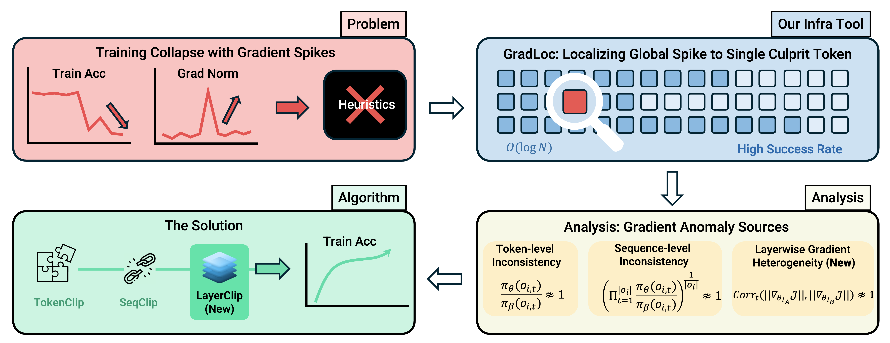

<!--# 🚀 GradLoc-->

<div align="center">

   <h1 align="center">
      🚀 GradLoc
   </h1>

<!-- [](https://github.com/Tencent-Hunyuan/GradLoc) -->
[](https://github.com/Tencent-Hunyuan/GradLoc/issues)
[](https://github.com/Tencent-Hunyuan/GradLoc/issues?q=is%3Aissue%20state%3Aclosed)
[](https://github.com/Tencent-Hunyuan/GradLoc/pulls)
[](https://github.com/Tencent-Hunyuan/GradLoc/pulls?q=is%3Apr+is%3Aclosed)
[](https://github.com/Tencent-Hunyuan/GradLoc/graphs/contributors)
[](https://github.com/Tencent-Hunyuan/GradLoc)

[](https://hy.tencent.com/research/100015?langVersion=en)
[](https://hy.tencent.com/research/100015?langVersion=zh)
[](https://x.com/tencenthunyuan/status/2022542892024345015?s=46)
[](https://www.xiaohongshu.com/search_result/69902d3a000000000c036e72?xsec_token=ABvsDb-DkxR-bQfCdAI-Lr4XhbC8KjIGKwtjv_NJ6jAbs=&xsec_source=pc_search)
[](#-tbd)
[](https://mp.weixin.qq.com/s/Q3iiBg7ODdKgbMwdEfrNGQ)
<!--[](#-tbd)-->


<p align="center">
  <strong> From black-box heuristics to white-box diagnostics for RLVR training collapse </strong><br/>
  <sub>Implementation patch for <strong>GradLoc</strong>, built on top of a fixed <tt>verl</tt> commit.</sub>
</p>
<!-- `GradLoc` is a lightweight, reproducible patch for diagnosing RLVR training collapse by localizing gradient spikes to culprit tokens, built on top of a fixed `verl` commit. -->



</div>


## 🔍 Overview

This repository implements the **GradLoc** part from our blog on RLVR training collapse diagnosis and stabilization.

The current release focuses on the **GradLoc** demo patch:

- **GradLoc**: localizes gradient spikes to exact culprit tokens with distributed binary search (`O(log N)`).


*Figure 2. GradLoc localization path: global -> micro-batch -> rank -> token, with adaptive thresholds.*

This repo is intentionally lightweight and patch-oriented, so you can directly apply changes to upstream `verl` and reproduce experiments.
We plan to further package GradLoc as a cleaner, configurable feature with better veRL integration and upstream-merge readiness in future releases.

The following arguments in `run_experiment.sh` are the core runtime knobs for GradLoc.
They control trigger sensitivity, search budget, and dump path.

```bash
actor_rollout_ref.actor.grad_norm_threshold=640.0 \          # Spike trigger threshold for token-level grad norm
actor_rollout_ref.actor.bisect_budget_steps=128 \            # Max binary-search budget (forward/backward probes)
actor_rollout_ref.actor.bisect_dump_dir="${CKPTS_DIR}/bisect_dump" \  # Output dir for localization artifacts
```

## 🧩 Base commit

- Upstream: `verl`
- Commit: `f9c855f7cf04d603c9546bc01776c74806a879c1`

## 📦 Files changed by this patch

- `verl/trainer/ppo/ray_trainer.py`
- `verl/utils/reward_score/__init__.py`
- `verl/utils/reward_score/math_verify.py`
- `verl/workers/actor/dp_actor.py`

## ⚡ Quick start (online patch)

1) Clone upstream `verl` and checkout the base commit:
   - `git clone https://github.com/volcengine/verl.git`
   - `cd verl && git checkout f9c855f7cf04d603c9546bc01776c74806a879c1`
2) Apply patch from URL:
   - `python /path/to/GradLoc-Patch/apply_patch.py --repo /path/to/verl --patch-url <PATCH_URL> --sha256-file <SHA256_URL>`

## 💾 Local patch (offline)

If `patches/gradloc.patch` is already available locally:

- `python /path/to/GradLoc-Patch/apply_patch.py --repo /path/to/verl --patch-file /path/to/GradLoc-Patch/patches/gradloc.patch`

## 🧪 Run experiment

- `bash /path/to/GradLoc-Patch/run_experiment.sh`

## 🛠️ Regenerate patch after development

When code is modified on top of the base commit, regenerate the patch with:

- `bash /path/to/GradLoc-Patch/make_patch.sh --repo /path/to/verl`

This rewrites `patches/gradloc.patch` from:
`git diff <base_commit> <current_head>`

## 📬 Contact Us

- Guanhua Huang: `carlan0974@gmail.com`
- Tingqiang Xu: `xtq23@mails.tsinghua.edu.cn`
- Jinbo Wang: `wangjinbo@stu.pku.edu.cn` (`wangjinbo@ustc.edu` for long-term contact)

## 📚 Citation

If you find this project useful, please cite:

```bibtex
@misc{huang-xu-wang-2026-gradloc,
  title = {Stabilizing RLVR via Token-level Gradient Diagnosis and Layerwise Clipping},
  author = {Huang, Guanhua and Xu, Tingqiang and Wang, Jinbo and Sheng, Guangming and Li, Siheng and Yang, Evander and Li, Kejiao and Li, Yunxiang and Xu, Zenan and Yi, Qi and Gong, Xue and Nan, Ziyuan and Jiang, Yuhao and Zhang, Chenchen and Wu, Taiqiang and Zhang, Feiyuan and Wang, Junhao and Zhou, Bo and Chen, Alex and Wang, Di and Yao, Shunyu},
  year = {2026},
  url = {https://hy.tencent.com/research/100015}
}
```

## ❓ TBD